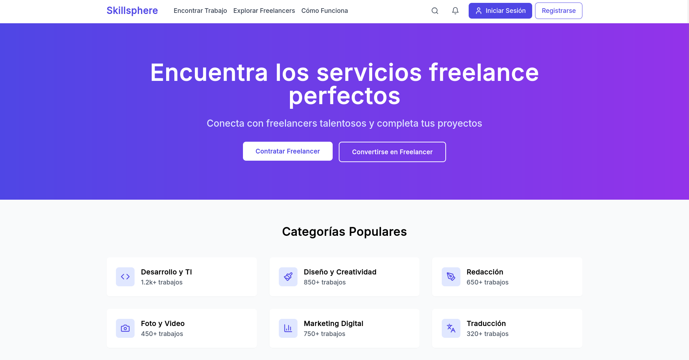

# Plataforma de Freelancing Skillsphere

Una plataforma que ofrece servicios de Freelancing y la posibilidad de publicar servicios para aquellos que busquen trabajo como Freelancers.

## Stack

* Backend
  * Django Rest Framework
* Front-End
  * Node.js
  * React
  * Vite
  * Tailwind CSS Framework
* Despliegue
  * Docker Compose

## Despliegue

* [Despliegue con Docker Compose](compose/README.md)

## Desarrollo

* [Desarrollo con Django](django/README.md)
* [Desarrollo con React](frontend/README.md)
