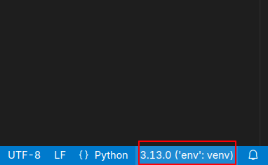
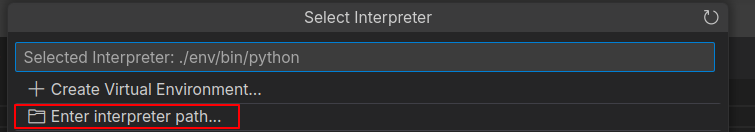
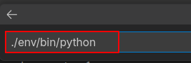

# Configuración Django

### Dependencias

`Python`

`venv`

## **Configuración Inicial**

Crea un ambiente virtual

```
python -m venv env
```


Entra en el ambiente virtual

```
### bash
source ./env/bin/activate

### fish
source ./env/bin/activate.fish

### Powershell
.\env\bin\Activate.ps1
```

Para configurar en VSCode, vea [estas instrucciones](#vscode-venv-setup).

Instala las dependencias de Python del proyecto

```
python -m pip install -r requirements.txt
```

Haz click en el botón del interpretador de Python en la parte inferior derecha de la interfaz.



Seleccona "Enter interpreter path..."



Introduce la dirección hacia el Python de tu ambiente virtual


